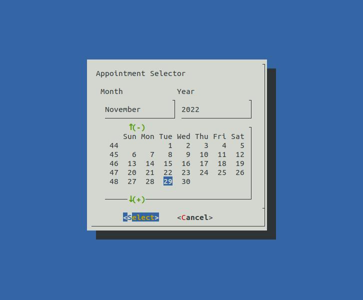
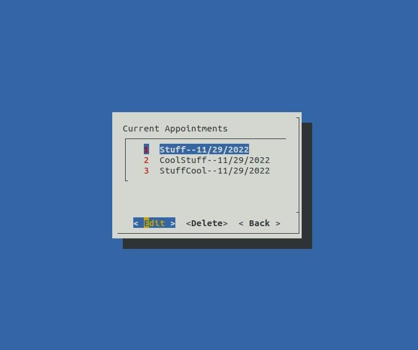
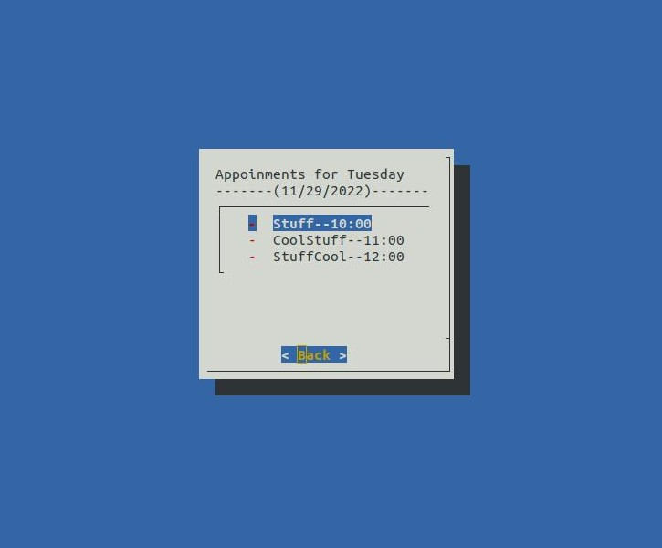
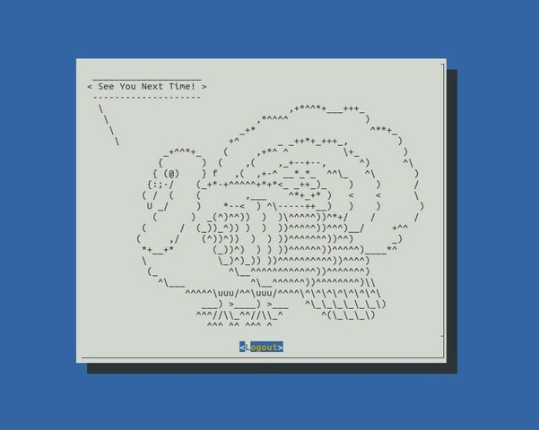

# CMDcal

## Summary

CMDcal is a small, command-line operated, appointment scheduling application built in a single Bash file. It makes use of the [Dialog](https://linux.die.net/man/1/dialog) library for the GUI, and saves all appointment data in a plain-text file called 'save.txt'. I built this for my CS224 class (currently in college) and am putting it here for street cred!

This program was built on Linux. No gurantees it will run anywhere else.

### Features
- Schedule an appointment (date, time, reason)

- View/Edit/Delete appointments

- View today's appointments

- Fun 'Logout' screen consisting of a random <a href="https://github.com/schacon/cowsay">cowsay</a> character

### Quirks
- Does not allow spaces in 'Appointment Details' window. Spaces will confuse loading data from 'save.txt' into windows. If this happens to you, remove all data from save.txt or remove incorrect entry. 
- Takes you back to homescreen after you have completed an action. (ex. You have just deleted an appointment -> instead of staying in 'Current Appointments' window, you are taken back to 'Main Menu')

## Install
1. Make file on local machine to clone repository into
2. Run `git clone https://github.com/sudoLuko/CMDcal.git` inside your file
3. Change into the project file `cd CMDcal`
4. Run executable called **main**

<a href="https://github.com/schacon/cowsay">cowsay</a>
